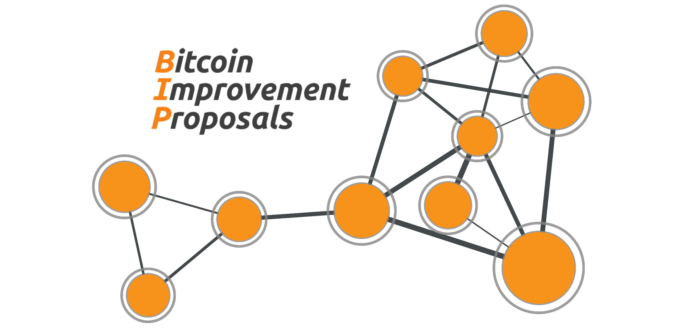

# Bitcoin Improvement Proposal Network Graph <!-- omit from toc -->



## Table of Contents
- [Documentation](#documentation)
  - [Requirements](#requirements)
  - [Main.py](#mainpy)
  - [Download.py](#downloadpy)
  - [preamble\_extraction.py](#preamble_extractionpy)
  - [bip\_processor.py](#bip_processorpy)
    - [Metadata](#metadata)
    - [Insights](#insights)
      - [Compliance Section](#compliance-section)
      - [Word List Section](#word-list-section)
  - [viz\_app.py](#viz_apppy)


## Introduction

Bitcoin Improvement Proposals (BIPs) are essential to the evolution of the Bitcoin protocol, characterized by both their individual attributes (e.g., status, categories) and interrelationships (e.g., dependencies, succession).
This project aims to mine and structure BIP data, archiving it in a browsable format that captures both these characteristics and connections.
Through graph-based visualizations and analysis, we seek to enable a more interactive exploration of the BIP landscape, enhancing both understanding and insight into the proposals and their roles within the ecosystem.

# Documentation

## Requirements
- Git: The script requires Git to clone and update the BIP repository.

## Main.py
Manages all the logic. Once you added the github token, you can run ```main.py```. It will 
- Clone the BIP repository if it’s not already present or update it if it is.
- Extract metadata from the Git history.
- Extract the preamble from each BIP document.
- Generate insights from the BIP contents.
- Store all extracted data into JSON files.

## Download.py
Clones all BIP's as *.md or *.mediawiki files & also downloads all associated files for each BIP. 
All files are saved into __bips_cloned__. 
Associated files are saved into the corresponding __bips_cloned/bips_xxxx__ folder.

## preamble_extraction.py
The <code>< pre>...< /pre></code> block gets extracted out of every .md/.mediawiki files inside the __bips_cloned__ folder.
It differentiates between the required fields and the optional fields.
If you have multi-line fields as they often appear in 'author' and 'licences', it adds a list to the corresponding key.
The extracted information inside the preamble gets placed in the __preamble__ section inside the JSON file.
All JSON files get saved in __bips_json__.

## bip_processor.py
Adds metadata and insights about each BIP to the corresponding JSON file. For the metadata, it adds
### Metadata
- **`last_commit`**: The date of the most recent commit for the BIP file (ISO 8601 format).
- **`total_commits`**: The total number of commits made to the BIP file.
- **`metadata_last_updated`**: The timestamp (ISO 8601 format) indicating when the metadata was last updated.
- **`git_history`**: A list of tuples containing the Git commit hash, date, and author for each commit in the BIP's history.
- **`contributors`**: The total number of unique contributors to the BIP file.
- **`google_trend_index`**: Placeholder for storing Google Trends data (not implemented yet).
### Insights
#### Compliance Section
- **`title_length_respected`**: Indicates whether the BIP title length adheres to the 44-character limit (`true`/`false`).
- **`title_length`**: The actual length of the BIP title in characters.
- **`abstract_length_respected`**: Indicates whether the word count of the "Abstract" section is within the limit of 200 words (`true`/`false`).
- **`abstract_word_count`**: The total word count of the "Abstract" section.
- **`created_date_format_correct`**: Indicates whether the `created` field in the preamble follows the ISO 8601 date format (`true`/`false`).
- **`required_fields_present`**: Indicates whether all required fields in the preamble are present and non-null (`true`/`false`).
- **`missing_fields`**: A list of required fields that are missing or null.
- **`layer_valid`**: Indicates whether the `layer` field in the preamble contains a valid value (`true`/`false`).

#### Word List Section
- **`word_list`**: A dictionary of words extracted from the raw content of the BIP file (excluding stop words). Each word is a key, and its frequency is the value, sorted in descending order of frequency.

## viz_app.py
Once you downloaded ```main.py```, you can run ```viz_app.py```. It will create a dash app, which you can look at in your browser through the IP ```http://127.0.0.1:8050/```. 
It creates a visualization of all the BIPs and color-codes the status of each BIP. The sizes correspond to the amount of unique contributors, the more contributors, the larger the dot.
You can filter for different statuses, enlargen the relative size of all the dots, hover over all the dots to see some more specifications.
At the bottom of the page, you can look at a wordcloud of all the displayed BIPs.
